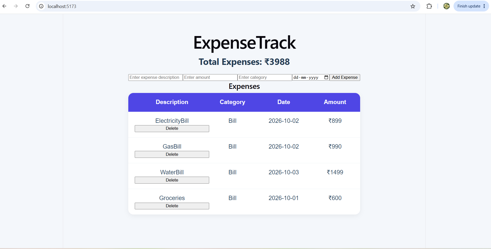
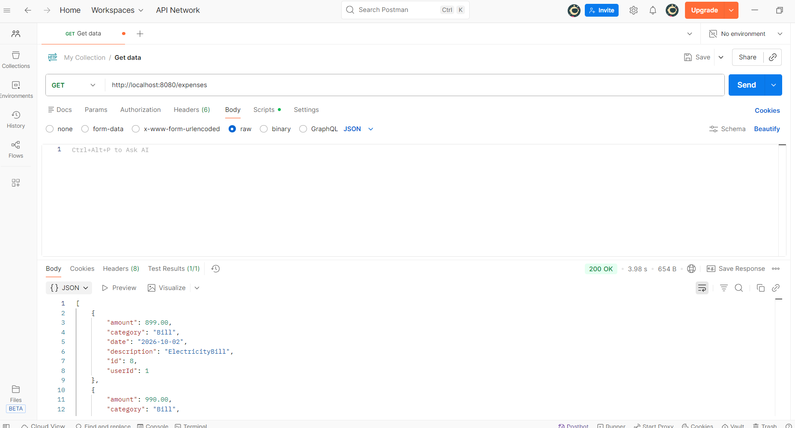

# 💰 ExpenseTrack
A full-stack expense tracking application built using **React, Java, Spring Boot, and MySQL**. The application allows users to add, view, and delete expenses while tracking their total spending.

## 🚀 Features

* Add and view expenses
* Delete expenses
* Calculate total expenses
* Categorize expenses and select dates
* Form validation
* REST API integration
* MySQL database persistence
* User registration with BCrypt password hashing
* Centralized exception handling

## 🛠️ Tech Stack

**Frontend**

* React
* JavaScript
* Axios
* HTML5 and CSS3
* Vite

**Backend**

* Java
* Spring Boot
* Spring Web
* Spring Data JPA
* Hibernate
* Maven
* REST APIs

**Database and Tools**

* MySQL
* Git and GitHub
* Eclipse
* VS Code
* Postman

## 🏗️ Architecture

The application follows a layered backend architecture.

```text
React Frontend
      |
    Axios
      |
  REST API
      |
Spring Boot Backend
      |
  Controller
      |
   Service
      |
  Repository
      |
  JPA / Hibernate
      |
    MySQL
```

**Backend layers**

* **Controller:** Handles HTTP requests and responses.
* **Service:** Contains business logic.
* **Repository:** Handles database operations through Spring Data JPA.
* **Entity:** Represents persistent database objects.
* **DTO:** Defines the request and response data structures.
* **Exception Handler:** Centralizes error handling.

## 📁 Project Structure

```text
expense-manager-frontend/
├── frontend/
│   ├── public/
│   ├── src/
│   │   ├── api/
│   │   │   └── expenseApi.js
│   │   ├── App.jsx
│   │   ├── App.css
│   │   ├── index.css
│   │   └── main.jsx
│   └── package.json
│
├── backend/
│   ├── src/
│   │   ├── main/
│   │   │   ├── java/com/naina/expensemanager/
│   │   │   └── resources/
│   │   └── test/
│   └── pom.xml
│
└── .gitignore
```

## 🔌 REST API Endpoints

### User API

| Method | Endpoint | Description     |
| ------ | -------- | --------------- |
| POST   | `/users` | Register a user |

### Expense API

| Method | Endpoint                  | Description               |
| ------ | ------------------------- | ------------------------- |
| POST   | `/expenses`               | Create an expense         |
| GET    | `/expenses`               | Retrieve all expenses     |
| GET    | `/expenses/{id}`          | Retrieve an expense by ID |
| GET    | `/expenses/user/{userId}` | Retrieve expenses by user |
| PUT    | `/expenses/{id}`          | Update an expense         |
| DELETE | `/expenses/{id}`          | Delete an expense         |

## 📦 Example Request

**POST `/expenses`**

```json
{
  "description": "Electricity Bill",
  "amount": 1200,
  "category": "Bills",
  "date": "2026-09-29",
  "userId": 1
}
```

## ⚙️ Setup Instructions

### Prerequisites

* Java 17 or later
* Node.js and npm
* MySQL
* Git

### 1. Clone the repository

```bash
git clone https://github.com/nainakooplikadan/expense-manager-frontend.git
cd expense-manager-frontend
```

### 2. Create the database

In MySQL, run:

```sql
CREATE DATABASE expense_manager;
```

### 3. Configure the backend

Set the `DB_PASSWORD` environment variable to your local MySQL password.

The backend reads the database password from an environment variable rather than storing it in the repository.

### 4. Start the backend

Open a terminal:

```powershell
cd backend
$env:DB_PASSWORD="your_mysql_password"
.\mvnw.cmd spring-boot:run
```

Replace `your_mysql_password` with your local MySQL password. The backend runs at:

`http://localhost:8080`

### 5. Start the frontend

Open a second terminal from the project root:

```bash
cd frontend
npm install
npm run dev
```

Open the local URL displayed by Vite, usually:

`http://localhost:5173`

## 🧪 API Testing

The backend REST endpoints can be tested using Postman.

Example:

`POST http://localhost:8080/expenses`

Use the example JSON request shown above.

## 🔐 Security

* BCrypt password hashing for user registration
* Request validation
* Centralized exception handling
* Database password supplied through an environment variable
* CORS configuration for local frontend-backend communication

JWT-based authentication is a planned enhancement.

## 📸 Screenshots

### ExpenseTrack Dashboard



### Postman API Response



## 🔮 Future Enhancements

* Login and JWT authentication
* Edit expense functionality in the frontend
* User-specific dashboards
* Monthly expense filtering
* Category-wise spending charts
* Search and pagination
* Responsive mobile layout
* Cloud deployment

## 👩‍💻 Author

**Naina Kooplikadan**

B.E. Biomedical Engineering | Software Developer

[GitHub Profile](https://github.com/nainakooplikadan)
